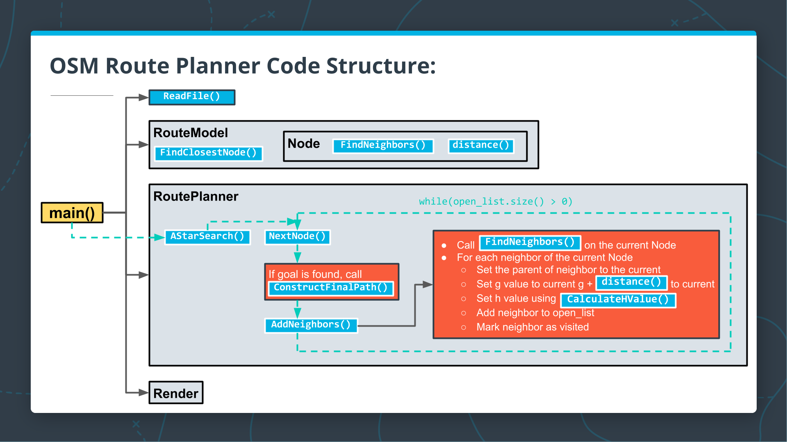

# Route Planning

## Overview
The starting code for this project comes from [a map rendering example](https://github.com/cpp-io2d/P0267_RefImpl/tree/master/P0267_RefImpl/Samples/maps) in the Github repo for the 2D Graphics Library, IO2D. This project will be extending the code to search for and display a path between two points on the map.


## Build and Install Udacity repo and IO2d repo
1. Clone library next to udacity repo
    ```
    git clone git@github.com:udacity/CppND-Route-Planning-Project.git
    cd CppND-Route-Planning-Project.git
    git submodule update --init --recursive
    ```
2. Follow build steps below, modified from [here](https://github.com/cpp-io2d/P0267_RefImpl/blob/master/BUILDING.md)

    ```
    sudo apt update
    sudo apt install build-essential
    sudo apt install cmake
    sudo apt install libcairo2-dev
    sudo apt install libgraphicsmagick1-dev
    sudo apt install libpng-dev

    git submodule add git@github.com:cpp-io2d/P0267_RefImpl.git
    cd P0267_RefImpl
    git submodule update --init --recursive
    code CMakeListst.txt -> comment out last two sections on TESTS and SAMPLES (why?)
    mkdir build 
    cd build
    cmake --config Release "-DCMAKE_BUILD_TYPE=Release" ..
    make
    sudo make install (this installs library to machine at ```/usr/local/include/io2d```, can use ```find -name``` to figure it out)
    ```

3. Build udacity project
    ```
    cd CppND-Route-Planning-Project
    mkdir build
    cd build
    cmake ..
    make
    ``` 

4. Run (should only open map, will do nothing else)
    ```
    ./OSM_A_star_search
    ```

## Test
After build run tests....
```
cd build
./test
```
Should get output similar to this (errors because code isn't built)
```
[06:48 PM][master]build $ ./test 
Running main() from /home/user/git/nanodegree/0_cpp_foundations/4_route_planner_project/CppND-Route-Planning-Project/thirdparty/googletest/googletest/src/gtest_main.cc
[==========] Running 4 tests from 1 test case.
[----------] Global test environment set-up.
[----------] 4 tests from RoutePlannerTest
[ RUN      ] RoutePlannerTest.TestCalculateHValue
/home/user/git/nanodegree/0_cpp_foundations/4_route_planner_project/CppND-Route-Planning-Project/test/utest_rp_a_star_search.cpp:66: Failure
Expected equality of these values:
  route_planner.CalculateHValue(start_node)
    Which is: 0.031656995
  1.1329799
/home/user/git/nanodegree/0_cpp_foundations/4_route_planner_project/CppND-Route-Planning-Project/test/utest_rp_a_star_search.cpp:67: Failure
Expected equality of these values:
  route_planner.CalculateHValue(end_node)
    Which is: 4.6308042e+27
  0.0f
    Which is: 0
/home/user/git/nanodegree/0_cpp_foundations/4_route_planner_project/CppND-Route-Planning-Project/test/utest_rp_a_star_search.cpp:68: Failure
Expected equality of these values:
  route_planner.CalculateHValue(mid_node)
    Which is: 4.0504058e-12
  0.58903033
[  FAILED  ] RoutePlannerTest.TestCalculateHValue (60 ms)
[ RUN      ] RoutePlannerTest.TestAddNeighbors
/home/user/git/nanodegree/0_cpp_foundations/4_route_planner_project/CppND-Route-Planning-Project/test/utest_rp_a_star_search.cpp:84: Failure
Expected equality of these values:
  neighbors.size()
    Which is: 0
  4
[  FAILED  ] RoutePlannerTest.TestAddNeighbors (34 ms)
[ RUN      ] RoutePlannerTest.TestConstructFinalPath
/home/user/git/nanodegree/0_cpp_foundations/4_route_planner_project/CppND-Route-Planning-Project/test/utest_rp_a_star_search.cpp:104: Failure
Expected equality of these values:
  path.size()
    Which is: 0
  3
Segmentation fault (core dumped)
```

## Code Architecture



## Project
See [README](CppND-Route-Planning-Project/README.md).