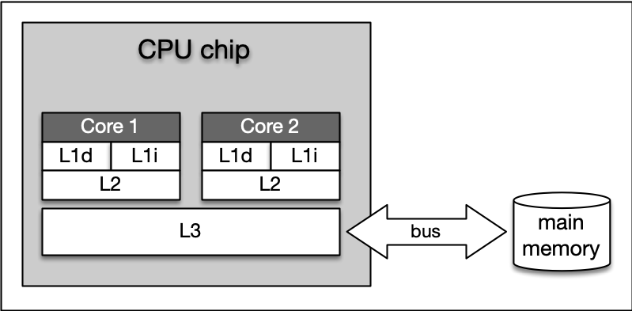
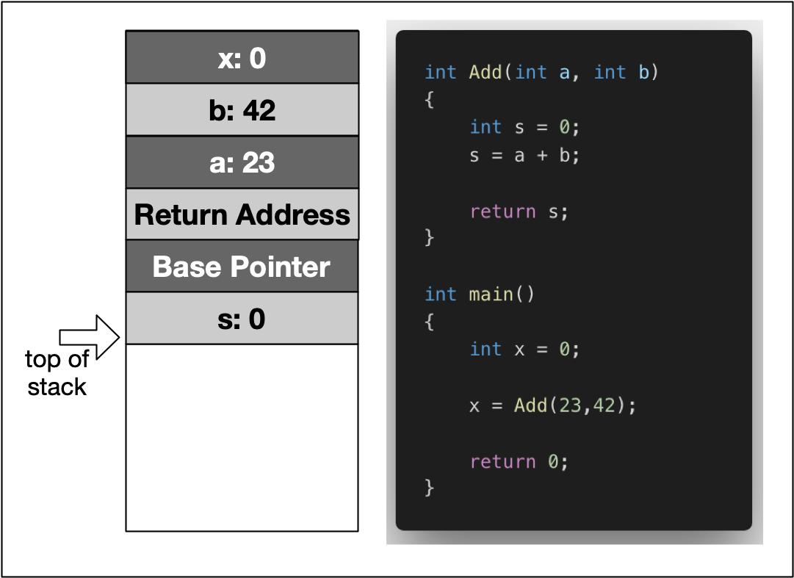
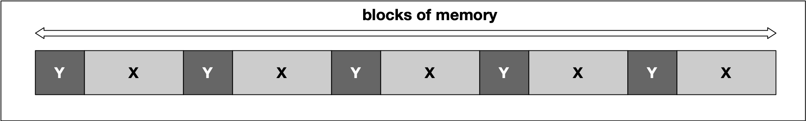
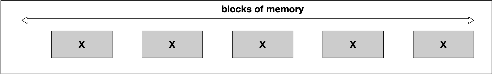
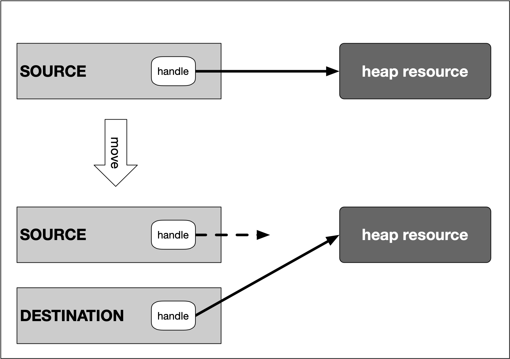

# Memory Management

1. Overview of Memory Types
Memory Addresses and Hexadecimal Numbers
Using the Debugger to Analyze Memory
Types of Computer Memory
Cache Memory
Virtual Memory
2. Variables and Memory
The Process Memory Model
Automatic Memory Allocation (The Stack)
Call-By-Value vs. Call-By-Reference
3.Dynamic Memory Allocation (The Heap)
Heap Memory
Using malloc and free
Using new and delete
Typical Memory Management Problems
4.Resource Copying Policies
Copy Semantics
Lvalues and rvalues
Move Semantics
5. Smart Pointers
Resource Acquisition Is Initialization (RAII)
Smart pointers
Transferring ownership


# Bits
John Atanasoff, proposed to use a coding system that expressed numbers as sequences of only two digits: one by the presence of a charge and one by the absence of a charge. This numbering system is called Base 2 or binary and it is represented by the digits 0 and 1 (called 'bit')

 Differentiating between only two symbols, especially at high frequencies, was much easier and more robust than with 10 digits.

## Hexadecimal 
(hex) numbers are used often in computer systems, e.g for displaying memory readouts - which is why we will look into this topic a little bit deeper. Instead of having a base of 2 (such as binary numbers) or a base of 10 (such as our conventional decimal numbers), hex numbers have a base of 16. 

## Hex over binary 
1.Readability: It is significantly easier for a human to understand hex numbers as they resemble the decimal numbers we are used to. It is simply not intuitive to look at binary numbers and decide how big they are and how they relate to another binary number.
2. Information density: A hex number with two digits can express any number from 0 to 255 (because 16^2 is 256). To do the same in the binary system, we would require 8 digits. This difference is even more pronounced as numbers get larger and thus harder to deal with.
3. Conversion into bytes: Bytes are units of information consisting of 8 bits. Almost all computers are byte-addressed, meaning all memory is referenced by byte, instead of by bit. Therefore, using a counting system that can easily convert into bytes is an important requirement. We will shortly see why grouping bits into a byte plays a central role in understanding how computer memory works.

For them, it was much easier and quicker to look at and interpret 7Einstead of 0111 1110. Ideally, they would have used the decimal system, but the conversion between base 2 and base 10 is much harder than between base 2 and base 16.

# gdb
[cheatsheet](https://darkdust.net/files/GDB%20Cheat%20Sheet.pdf)
[how to ](https://www.onlinegdb.com/blog/brief-guide-on-how-to-use-onlinegdb-debugger/)

## commands 
run 
1. continue – Resume program execution until next breakpoint is reached
2. step into – Execute program line by line stepping into function
3. step over – Execute program line by line but don’t go inside function call
4. step out – Resume program execution until current function is finished

## breakpoint
list - displays text of code 
break <line #>, can also set in vs code gui
p - print
x - shows the memory , 
- x/nfu <address>, 
    - n= number of units you want to print , 7 characters in "udacity" to we want to print 7
    - f= format, t for binary 
    - u=unit, b for byte 
## Example
```
gdb <executable>
break 5
run 
step //moves to line 5 
p str1 // prints variable str1, content of char array "UDACITY"
p &str1 // print address of array, location in mem where first character is located in memory
x/7tb 0x7ffeefb... // to show this memory, values in binary 
x/7xb 0x7ffeefb... // to show this memory, values in hex 
```

# Types of Memory 
RAM / ROM
Cache (L1, L2)
Registers
Virtual Memory
Hard Disks, USB drives

When the CPU of a computer needs to access memory, it wants to do this with minimal latency. though, low latency and large memory are not compatible with each other (at least not at a reasonable price). In practice, the decision for low latency usually results in a reduction of the available storage capacity (and vice versa).


CPU and its ultra-fast (but small) registers used for short-term data storage reside at the top of the pyramid. Below are Cache and RAM, which belong to the category of temporary memory which quickly looses its content once power is cut off. Finally, there are permanent storage devices such as the ROM, hard drives as well as removable drives such as USB sticks.

## RAM
RAM is considered "random access" because any memory cell can be accessed directly by intersecting the respective row and column in the matrix-like memory layout. For performance reasons, many parts of the OS are kept in RAM as long as the computer is powered on.

When an application is started, it is loaded into RAM. However, several application components are only loaded into RAM on demand to preserve memory. Files that are opened during runtime are also loaded into RAM. When a file is saved, it is written to the specified storage device. After closing the application, it is deleted from RAM.

## CPU
1. The bit size of the CPU decides how many bytes of data it can access in RAM memory at the same time. A 16-bit CPU can access 2 bytes (with each byte consisting of 8 bit) while a 64-bit CPU can access 8 bytes at a time.
2. The processing speed of the CPU is measured in Gigahertz or Megahertz and denotes the number of operations it can perform in one second.

From processing speed and bit size, the data rate required to keep the CPU busy can easily be computed by multiplying bit size with processing speed. With modern CPUs and ever-increasing speeds, the available RAM in the market will not be fast enough to match the CPU data rate requirements.

## Cache Levels 
Cache memory is much faster but also significantly smaller than standard RAM. It holds the data that will (or might) be used by the CPU more often. In the memory hierarchy we have seen in the last section, the cache plays an intermediary role between fast CPU and slow RAM and hard disk



1. Level 1 cache is the fastest and smallest memory type in the cache hierarchy. In most systems, the L1 cache is not very large. Mostly it is in the range of 16 to 64 kBytes, where the memory areas for instructions and data are separated from each other (L1i and L1d, where "i" stands for "instruction" and "d" stands for "data". 
2.  Level 2 cache is located close to the CPU and has a direct connection to it. The information exchange between L2 cache and CPU is managed by the L2 controller on the computer main board. The size of the L2 cache is usually at or below 2 megabytes. The choice between a processor with more clock speed or a larger L2 cache can be answered as follows: With a higher clock speed, individual programs run faster, especially those with high computing requirements. As soon as several programs run simultaneously, a larger cache is advantageous. Usually normal desktop computers with a processor that has a large cache are better served than with a processor that has a high clock rate
3. Level 3 cache is shared among all cores of a multicore processor. With the L3 cache, the cache coherence protocol of multicore processors can work much faster. This protocol compares the caches of all cores to maintain data consistency so that all processors have access to the same data at the same time. The L3 cache therefore has less the function of a cache, but is intended to simplify and accelerate the cache coherence protocol and the data exchange between the cores

On Mac, information about the system cache can be obtained by executing the command `sysctl -a hw` in a terminal. On Debian Linux linux, this information can be found with `lscpu | grep cache`

In algorithm design, programmers can exploit two principles to increase runtime performance:
1. *Temporal locality* means that address ranges that are accessed are likely to be used again in the near future. In the course of time, the same memory address is accessed relatively frequently (e.g. in a loop). This property can be used at all levels of the memory hierarchy to keep memory areas accessible as quickly as possible.
2. *Spatial locality* means that after an access to an address range, the next access to an address in the immediate vicinity is highly probable (e.g. in arrays). In the course of time, memory addresses that are very close to each other are accessed again multiple times. This can be exploited by moving the adjacent address areas upwards into the next hierarchy level during a memory access.

# Virtual Memory 
Virtual memory is a very useful concept in computer architecture because it helps with making your software work well given the configuration of the respective hardware on the computer it is running on

Programers needed to treat memory as a precious resource and use it most efficiently. Also, they wanted to be able to run programs even if there was not enough RAM available. There are several other memory-related problems, that programmers need to know about:
1. Holes in address space : If several programs are started one after the other and then shortly afterwards some of these are terminated again, it must be ensured that the freed-up space in between the remaining programs does not remain unused. If memory becomes too fragmented, it might not be possible to allocate a large block of memory due to a large-enough free contiguous block not being available any more.
2. Programs writing over each other : If several programs are allowed to access the same memory address, they will overwrite each others' data at this location. In some cases, this might even lead to one program reading sensitive information (e.g. bank account info) that was written by another program. This problem is of particular concern when writing concurrent programs which run several threads at the same time.

The basic idea of virtual memory is to separate the addresses a program may use from the addresses in physical computer memory. By using a mapping function, an access to (virtual) program memory can be redirected to a real address which is guaranteed to be protected from other programs.

2^32 bytes = 4GB; a 32-bit address space gives a program a (theoretical) total of 4 GB of memory it can address. 

each program is promised to have access to an address space ranging from 0x00000000 up to 0xFFFFFFFF. If however, the available physical memory is only 1GB in size, a 1-on-1 mapping would lead to undefined behavior as soon as the 30-bit RAM address space were exceeded.

With virtual memory however, a mapping is performed between the virtual address space a program sees and the physical addresses of various storage devices such as the RAM but also the hard disk. Mapping makes it possible for the operating system to use physical memory for the parts of a process that are currently being used and back up the rest of the virtual memory to a secondary storage location such as the hard disk. With virtual memory, the size of RAM is not the limit anymore as the system hard disk can be used to store information as well.

- A memory page is a number of directly successive memory locations in virtual memory defined by the computer architecture and by the operating system. The computer memory is divided into memory pages of equal size. The use of memory pages enables the operating system to perform virtual memory management. The entire working memory is divided into tiles and each address in this computer architecture is interpreted by the Memory Management Unit (MMU) as a logical address and converted into a physical address.
- A memory frame is mostly identical to the concept of a memory page with the key difference being its location in the physical main memory instead of the virtual memory.

# Memory Model 


From a programming perspective though, we are not able to use the entire address space. Instead, the blocks "OS Kernel Space" and "Text" are reserved for the operating system. In kernel space, only the most trusted code is executed - it is fully maintained by the operating system and serves as an interface between the user code and the system kernel. The section called 'text' holds the program code generated by the compiler and linker.

1. The **stack** is a contiguous memory block with a fixed maximum size. If a program exceeds this size, it will crash. The stack is used for storing automatically allocated variables such as local variables or function parameters. If there are multiple threads in a program, then each thread has its own stack memory. New memory on the stack is allocated when the path of execution enters a scope and freed again once the scope is left. 
    - It is important to know that the stack is managed "automatically" by the compiler, which means we do not have to concern ourselves with allocation and deallocation.
2. The **heap** (also called "free store" in C++) is where data with dynamic storage lives. It is shared among multiple threads in a program, which means that memory management for the heap needs to take concurrency into account. This makes memory allocations in the heap more complicated than stack allocations. In general, managing memory on the heap is more (computationally) expensive for the operating system, which makes it **slower than stack memory**. 
    - Contrary to the stack, the heap is not managed automatically by the system, but by the programmer. If memory is allocated on the heap, it is the programmer’s responsibility to free it again when it is no longer needed. If the programmer manages the heap poorly or not at all, there will be trouble.
3. The **BSS** (Block Started by Symbol) segment is used in many compilers and linkers for a segment that contains global and static variables that are initialized with zero values. This memory area is suitable, for example, for arrays that are not initialized with predefined values.
4. The **Data** segment serves the same purpose as the BSS segment with the major difference being that variables in the Data segment have been initialized with a value other than zero. Memory for variables in the Data segment (and in BSS) is allocated once when a program is run and persists throughout its lifetime.

# Memory allocation 
Not every variable in a program has a permanently assigned area of memory. The term allocate refers to the process of assigning an area of memory to a variable to store its value. A variable is deallocated when the system reclaims the memory from the variable, so it no longer has an area to store its value.

1. **Static** memory allocation is performed for static and global variables, which are stored in the BSS and Data segment. Memory for these types of variables is allocated once when your program is run and persists throughout the life of your program.
2. **Automatic** memory allocation is performed for function parameters as well as local variables, which are stored on the stack. Memory for these types of variables is allocated when the path of execution enters a scope and freed again once the scope is left.
3. **Dynamic** memory allocation is a possibility for programs to request memory from the operating system at runtime when needed. This is the major difference between automatic and static allocation, where the size of the variable must be known at compile time. Dynamic memory allocation is not performed on the limited stack but on the heap and is thus (almost) only limited by the size of the address space.

stack should be the default choice for the programmer, if size isnt an issue 

# Properties of Stack Memory
The stack is the place in virtual memory where the local variables reside, including arguments to functions. Each time a function is called, the stack grows (from top to bottom) and each time a function returns, the stack contracts. When using multiple threads (as in concurrent programming), it is important to know that each thread has its own stack memory - which can be considered thread-safe.

1. The stack is a ***contiguous block of memory**. It will not become fragmented (as opposed to the heap) and it has a fixed maximum size.
2. When the **maximum size of the stack** memory is exceeded, a program will crash.
3. Allocating and deallocating **memory is fast** on the stack. It only involves moving the stack pointer to a new position.



In the example, the variable x is created on the stack within the scope of main. Then, a stack frame which represents the function Add and its variables is pushed to the stack, moving the stack pointer further downwards. It can be seen that this includes the local variables a and b, as well as the return address, a base pointer and finally the return value s.

Total Stack Size
When a thread is created, stack memory is allocated by the operating system as a contiguous block. With each new function call or local variable allocation, the stack pointer is moved until eventually it will reach the bottom of said memory block. Once it exceeds this limit (which is called "stack overflow"), 


# Variable Scopes in C++
The time between allocation and deallocation is called the lifetime of a variable
- Local variables are only available within their respective scope (e.g. inside a function) and are simply not available outside
- As long as the current thread of execution is within function A, memory for the local variables remains allocated. This even holds true in case another function B is called from within the current function A and the thread of execution moves into this nested function call

## pass by value vs pointer example 
```cpp

void AddTwo(int val) //pass by value
{
    val += 2;
}

void AddThree(int *val) //pass by pointer 
{
    *val += 3;
}

//faster as no information needs to be copied
void AddFour(int &val) //pass by reference
{
    val += 4;
}

int main()
{
    int val = 0;
    AddTwo(val);
    val += 2;
    std::cout << "val = " << val << std::endl; // "val = 2

    int valB = 0;
    AddThree(&valB);
    valB += 2;
    std::cout << "valB = " << valB << std::endl; // "valB = 5

    int valC = 0;
    AddFour(valC); 
    valC += 2;
    std::cout << "valC = " << valC << std::endl; // "valC = 6
  
    return 0;
}
```

## Modifying several parameters
An additional advantage of passing variables by reference is the possibility to modify several variables. When using the function return value for such a purpose, returning several variables is usually very cumbersome.

```cpp
void AddFive(int &val, bool &sucess)
{
    val += 5;
    sucess = true;
}
```

## Pointers vs. References
- Pointers can be declared without initialization. This means we can pass an uninitialized pointer to a function who then internally performs the initialization for us.
- Pointers can be reassigned to another memory block on the heap.
- References are usually easier to use (depending on the expertise level of the programmer). Sometimes however, if a third-party function is used without properly looking at the parameter definition, it might go unnoticed that a value has been modified.

Note: In order to benefit from call-by-reference, the size of the data type passed to the function has to surpass the size of the pointer on the respective architecture (i.e. 32 bit or 64 bit).
- for example, for a 64bit system the size of an int is 4 bytes and the size of a pointer is 8 (As my machine has a 64 bit architecture, an address requires 8 byte.)

# Heap 
The heap memory grows upwards while the stack grows in the opposite direction. The programmer can request the allocation of memory by issuing a command such as malloc or new (more on that shortly). This block of memory will remain allocated until the programmer explicitly issues a command such as free or delete. The huge advantage of heap memory is the high degree of control a programmer can exert, albeit at the price of greater responsibility since memory on the heap must be actively managed.

1. As opposed to local variables on the stack, memory can now be allocated in an arbitrary scope (e.g. inside a function) without it being deleted when the scope is left. Thus, as long as the address to an allocated block of memory is returned by a function, the caller can freely use it.
2. Local variables on the stack are allocated at compile-time. Thus, the size of e.g. a string variable might not be appropriate as the length of the string will not be known until the program is executed and the user inputs it. With local variables, a solution would be to allocate a long-enough array of and hope that the actual length does not exceed the buffer size. With dynamically allocated heap memory, variables are allocated at run-time. This means that the size of the above-mentioned string variable can be tailored to the actual length of the user input.
3. Heap memory is only constrained by the size of the address space and by the available memory. With modern 64 bit operating systems and large RAM memory and hard disks the programmer commands a vast amount of memory. However, if the programmer forgets to deallocate a block of heap memory, it will remain unused until the program is terminated. This is called a **"memory leak"**.
4. Unlike the stack, the heap is shared among multiple threads, which means that memory management for the heap needs to take concurrency into account as several threads might compete for the same memory resource.
5. When memory is allocated or deallocated on the stack, the stack pointer is simply shifted upwards or downwards. Due to the sequential structure of stack memory management, stack memory can be managed (by the operating system) easily and securely. With heap memory, allocation and deallocation can occur arbitrarily, depending on the lifetime of the variables. 
    - This can result in fragmented memory over time, which is much more difficult and expensive to manage.

## Memory Fragmentation 
Suppose we are interleaving the allocation of two data types X and Y in the following fashion


At some point, we might then decide to deallocate all variables of type Y, leading to empty spaces in between the remaining variables of type X


A classic symptom of memory fragmentation is that you try to allocate a large block and you can’t, even though you appear to have enough memory free. On systems with virtual memory however, this is less of a problem, because large allocations only need to be contiguous in virtual address space, not in physical address space. When memory is heavily fragmented however, memory allocations will likely take longer because the memory allocator has to do more work to find a suitable space for the new object.

# malloc and free
it is not always possible to plan the memory requirements exactly in advance, and it is inefficient to reserve the maximum memory space each time just to be on the safe side.

To allocate dynamic memory on the heap means to make a contiguous memory area accessible to the program at runtime and to mark this memory as occupied so that no one else can write there by mistake.To reserve memory on the heap, one of the two functions **malloc** (stands for Memory Allocation) or **calloc** (stands for Cleared Memory Allocation) is used. The header file stdlib.h or malloc.h must be included to use the functions.
```cpp
pointer_name = (cast-type*) malloc(size);
pointer_name = (cast-type*) calloc(num_elems, size_elem);
```

- **malloc** is used to dynamically allocate a single large block of memory with the specified size.
- **calloc** is used to dynamically allocate the specified number of blocks of memory of the specified type. It initializes each block with a default value '0'.

Both functions return a pointer of type void which can be cast into a pointer of any form. If the space for the allocation is insufficient, a NULL pointer is returned.

## casting the return type
- the `sizeof` command is a convenient way of specifying the amount of memory (in bytes) needed to store a certain data type. 
```cpp
int main() 
{ 
    void *p = malloc(sizeof(int));
    printf("address=%p, value=%d\n", p, *p); //gives an error, C++ does not allow indirection on operand of type 'void *'
    // The problem with void pointers is that there is no way of knowing the offset to the end of the allocated memory block.

    // instead cast the return type 
    int *p = (int*)malloc(sizeof(int));


    return 0; 
}
```

## Memory for Arrays and Structs

```cpp
// array
  int *p = (int*)malloc(3*sizeof(int));
    p[0] = 1; p[1] = 2; p[2] = 3;
    printf("address=%p, second value=%d\n", p, p[1]);

// struct
struct MyStruct {
    int i; 
    double d; 
    char a[5];
};

MyStruct *p = (MyStruct*)calloc(4,sizeof(MyStruct));
p[0].i = 1; p[0].d = 3.14159; p[0].a[0] = 'a';
```

## realloc 
The size of the memory area reserved with malloc or calloc can be increased or decreased with the realloc function.
```cpp
pointer_name = (cast-type*) realloc( (cast-type*)old_memblock, new_size );
```
- Depending on the compiler, the reserved memory area is either (a) expanded or reduced internally (if there is still enough free heap after the previously reserved memory area) or (b) a new memory area is reserved in the desired size and the old memory area is released afterwards.
- The data from the old memory area is retained, i.e. if the new memory area is larger, the data will be available within new memory area as well. If the new memory area is smaller, the data from the old area will be available only up until the site of the new area - the rest is lost.

ex) 
Note that realloc has been used to increase the memory size and then decrease it immediately after assigning the values 3 and 4 to the new blocks. 
- Interestingly, the pointers p+2 and p+3 can still access the memory location they point to. Also, the original data (numbers 3 and 4) is still there. So realloc will not erase memory but merely mark it as "available" for future allocations. It should be noted however that accessing a memory location after such an operation must be avoided as it could cause a segmentation fault.

## Freeing memory 
If memory has been reserved, it should also be released as soon as it is no longer needed. The free function releases the reserved memory area so that it can be used again or made available to other programs.
```cpp
    void *p = malloc(100); 
    free(p);
```
- free can only free memory that was reserved with malloc or calloc.
- free can only release memory that has not been released before. Releasing the same block of memory twice will result in an error.

```cpp
    void *p = malloc(100); 
    void *p2 = p;
    free(p); //OK
    free(p2); //ERROR
```
- The pointer p2 in the example is invalid as soon as free(p) is called. It still holds the address to the memory location which has been freed, but may not access it anymore. Such a pointer is called a "dangling pointer".

### Example 
```cpp
int *f1(void)
{
    int x = 10;
    return (&x);
}

int *f2(void)
{
    int *px;
    *px = 10;
    return px;
}

int *f3(void)
{
    int *px;
    px = (int *)malloc(sizeof(int));
    *px = 10;
    return px;
}
```
- In f1, the pointer variable x is a local variable to f1, and f1 returns the pointer to that variable. x can disappear after f1() is returned if x exists on the stack. So &x can become invalid.
- In f2, the pointer variable px is assigned a value without allocating its space.
- f3 works fine. Memory is allocated to the pointer variable px using malloc(). So, px exists on the heap, its existence will remain in memory even after the return of f3() as it is on the heap.

# new and delete

## malloc vs new 
The functions malloc and free are library function and represent the default way of allocating and deallocating memory in C. In C++, they are also part of the standard and can be used to allocate blocks of memory on the heap.

1. Constructors / Destructors Unlike malloc( sizeof(MyClass) ), the call new MyClass() calls the constructor. Similarly, delete calls the destructor.
2. Type safety malloc returns a void pointer, which needs to be cast into the appropriate data type it points to. This is not type safe, as you can freely vary the pointer type without any warnings or errors
3. Operator Overloading As malloc and free are functions defined in a library, their behavior can not be changed easily. The new and delete operators however can be overloaded by a class in order to include optional proprietary behavior.


## delete
As with malloc and free, a call to new always has to be followed by a call to delete to ensure that memory is properly deallocated. . If the programmer forgets to call delete on the object (which happens quite often, even with experienced programmers), the object resides in memory until the program terminates at some point in the future causing a **memory leak**. The call to delete causes the following:
- The object of type MyClass is destroyed by calling its destructor
- The memory which the object was placed in is deallocated

## Optimizing Performance with placement new
Consider a case where we need to reconstruct an object several times. If we were to use the standard new/delete construct, memory would be allocated and freed unnecessarily as only the content of the memory block changes but not its size. By separating allocation from construction, we can get a significant performance increase.

C++ allows us to do this by using a construct called placement new: With placement new, we can pass a preallocated memory and construct an object at that memory location.
```cpp
    void *memory = malloc(sizeof(MyClass));
    MyClass *object = new (memory) MyClass
```
The syntax new (memory) is denoted as placement new. The difference to the "conventional" new we have been using so far is that that no memory is allocated. The call constructs an object and places it in the assigned memory location. There is however, no delete equivalent to placement new, so we have to call the destructor explicitly in this case instead of using delete as we would have done with a regular call to new:
```cpp
    object->~MyClass();
    free(memory); 
```

## Overloading new and delete
The syntax for overloading the new operator looks as follows:
```
void* operator new(size_t size);
```
The operator receives a parameter size of type size_t, which specifies the number of bytes of memory to be allocated. The return type of the overloaded new is a void pointer, which references the beginning of the block of allocated memory.

The syntax for overloading the delete operator looks as follows:
```
void operator delete(void*);
```
The operator takes a pointer to the object which is to be deleted. As opposed to new, the operator delete does not have a return value.

```cpp
#include <iostream>
#include <stdlib.h>

class MyClass
{
    int _mymember;

public:
    MyClass()
    {
        std::cout << "Constructor is called\n";
    }

    ~MyClass()
    {
        std::cout << "Destructor is called\n";
    }

    void *operator new(size_t size)
    {
        std::cout << "new: Allocating " << size << " bytes of memory" << std::endl;
        void *p = malloc(size);

        return p;
    }

    void operator delete(void *p)
    {
        std::cout << "delete: Memory is freed again " << std::endl;
        free(p);
    }
};

int main()
{
    MyClass *p = new MyClass(); //dont have to send the size, complier auto sets it to the size of myclass? (4 bytes for int)
    delete p;
}
```

Overloading to create an array of classes 
```cpp
    void *operator new[](size_t size)
    {
        std::cout << "new: Allocating " << size << " bytes of memory" << std::endl;
        void *p = malloc(size);

        return p;
    }

    void operator delete[](void *p)
    {
        std::cout << "delete: Memory is freed again " << std::endl;
        free(p);
    }
};

int main()
{
    MyClass *p = new MyClass[3]();
    delete[] p;
}

```

## Reasons for overloading 
1. The overloaded new operator function allows to add additional parameters. Therefore, a class can have multiple overloaded new operator functions. This gives the programmer more flexibility in customizing the memory allocation for objects.
2. Overloaded the new and delete operators provides an easy way to integrate a mechanism similar to garbage collection capabilities (such as in Java), as we will shorty see later in this course.
3. By adding exception handling capabilities into new and delete, the code can be made more robust.
4. It is very easy to add customized behavior, such as overwriting deallocated memory with zeros in order to increase the security of critical application data.

# Typical Memory Management Problems
1. Memory Leaks 
- Memory leaks occur when data is allocated on the heap at runtime, but not properly deallocated. 
- A program that forgets to clear a memory block is said to have a memory leak - this may be a serious problem or not, depending on the circumstances and on the nature of the program. For a program that runs, computes something, and quits immediately, memory leaks are usually not a big concern. Memory leaks are mostly problematic for programs that run for a long time and/or use large data structures. In such a case, memory leaks can gradually fill the heap until allocation requests can no longer be properly met and the program stops responding or crashes completely. 
2. Buffer Overruns 
- Buffer overruns occur when memory outside the allocated limits is overwritten and thus corrupted. One of the resulting problems is that this effect may not become immediately visible. When a problem finally does occur, cause and effect are often hard to discern. It is also sometimes possible to inject malicious code into programs in this way, but this shall not be discussed here.
- In this example, the allocated stack memory is too small to hold the entire string, which results in a segmentation fault:

`char str[5]; strcpy(str,"BufferOverrun"); printf("%s",str);`

3. **Uninitialized Memory** Depending on the C++ compiler, data structures are sometimes initialized (most often to zero) and sometimes not. So when allocating memory on the heap without proper initialization, it might sometimes contain garbage that can cause problems.

4. **Incorrect pairing of allocation and deallocation** Freeing a block of memory more than once will cause a program to crash. This can happen when a block of memory is freed that has never been allocated or has been freed before. Such behavior could also occur when improper pairings of allocation and deallocation are used such as using `malloc()` with `delete` or `new` with `free()`.
	In this first example, the wrong `new` and `delete` are paired
	
	`double *pDbl=new double[5]; delete pDbl;`
	
	In this second example, the pairing is correct but a double deletion is performed:
	
	`char *pChr=new char[5]; delete[] pChr; delete[] pChr;`

5. **Invalid memory access** This error occurs then trying to access a block of heap memory that has not yet or has already been deallocated.

# Valgrind 
The Memcheck tool within Valgrind can be used to detect typical errors in programs written in C or C++ that occur in connection with memory management. It is probably the best-known tool in the Valgrind suite, and the name Valgrind is often used as a synonym for Memcheck.

## example
`valgrind --leak-check=full --show-leak-kinds=all --track-origins=yes --log-file=/home/workspace/valgrind-out.txt /home/workspace/a.out`

Let us look at the call parameters one by one:

- **--leak-check** : Controls the search for memory leaks when the client program finishes. If set to `summary`, it says how many leaks occurred. If set to `full`, each individual leak will be shown in detail.
    
- **--show-leak-kinds** : controls the set of leak kinds to show when —leak-check=full is specified. Options are `definite`, `indirect`, `possible` `reachable`, `all` and `none`
    
- **--track-origins** : can be used to see where uninitialized values come from.
You can read the file into the terminal with:

`cat valgrind-out.txt`
Search for LEAK SUMMARY to see memory leak info 


# Copy Semantics
In C++, a common way of safely accessing resources is by wrapping a manager class around the handle, which is initialized when the resource is acquired (in the class constructor) and released when it is deleted (in the class destructor).

## No Copying policy 
This can be achieved by declaring, but not defining a private copy constructor and assignment operator (see `NoCopyClass1` below) or alternatively by making both public and assigning the `delete` operator (see `NoCopyClass2` below). The second choice is more explicit and makes it clearer to the programmer that copying has been actively forbidden

```cpp
class NoCopyClass1
{
private:
    NoCopyClass1(const NoCopyClass1 &);
    NoCopyClass1 &operator=(const NoCopyClass1 &);

public:
    NoCopyClass1(){};
};

class NoCopyClass2
{
public:
    NoCopyClass2(){}
    NoCopyClass2(const NoCopyClass2 &) = delete;
    NoCopyClass2 &operator=(const NoCopyClass2 &) = delete;
};

int main()
{
    NoCopyClass1 original1;
    NoCopyClass1 copy1a(original1); // copy c’tor
    NoCopyClass1 copy1b = original1; // assigment operator

    NoCopyClass2 original2;
    NoCopyClass2 copy2a(original2); // copy c’tor
    NoCopyClass2 copy2b = original2; // assigment operator

    return 0;
}
```
error: calling a private constructor of class 'NoCopyClass1' NoCopyClass1 copy1(original1); NoCopyClass1 copy1b = original1; error: call to deleted constructor of 'NoCopyClass2' NoCopyClass2 copy2(original2); NoCopyClass2 copy2b = original2;

## Exclusive ownership policy

This policy states that whenever a resource management object is copied, the resource handle is transferred from the source pointer to the destination pointer. In the process, the source pointer is set to `nullptr` to make ownership exclusive. At any time, the resource handle belongs only to a single object, which is responsible for its deletion when it is no longer needed.
```cpp
#include <iostream>

class ExclusiveCopy
{
private:
    int *_myInt;

public:
    ExclusiveCopy()
    {
        _myInt = (int *)malloc(sizeof(int));
        std::cout << "resource allocated" << std::endl;
    }
    ~ExclusiveCopy()
    {
        if (_myInt != nullptr)
        {
            free(_myInt);
            std::cout << "resource freed" << std::endl;
        }
            
    }
    ExclusiveCopy(ExclusiveCopy &source)
    {
        _myInt = source._myInt;
        source._myInt = nullptr;
    }
    ExclusiveCopy &operator=(ExclusiveCopy &source)
    {
        _myInt = source._myInt;
        source._myInt = nullptr;
        return *this;
    }
};

int main()
{
    ExclusiveCopy source;
    ExclusiveCopy destination(source);

    return 0;
}
```

 One problem in this implementation is that for a short time there are effectively two valid handles to the same resource - after the handle has been copied and before it is set to `nullptr`. In concurrent programs, this would cause a data race for the resource. A much better alternative to handle exclusive ownership in C++ would be to use move semantics

## Deep copying policy
With this policy, copying and assigning class instances to each other is possible without the danger of resource conflicts. The idea is to allocate proprietary memory in the destination object and then to copy the content to which the source object handle is pointing into the newly allocated block of memory. This way, the content is preserved during copy or assignment. However, this approach increases the memory demands and the uniqueness of the data is lost: After the deep copy has been made, two versions of the same resource exist in memory.
```cpp
#include <iostream>

class DeepCopy
{
private:
    int *_myInt;

public:
    DeepCopy(int val)
    {
        _myInt = (int *)malloc(sizeof(int));
        *_myInt = val;
        std::cout << "resource allocated at address " << _myInt << std::endl;
    }
    ~DeepCopy()
    {
        free(_myInt);
        std::cout << "resource freed at address " << _myInt << std::endl;
    }
    DeepCopy(DeepCopy &source)
    {
        _myInt = (int *)malloc(sizeof(int));
        *_myInt = *source._myInt;
        std::cout << "resource allocated at address " << _myInt << " with _myInt = " << *_myInt << std::endl;
    }
    DeepCopy &operator=(DeepCopy &source)
    {
        _myInt = (int *)malloc(sizeof(int));
        std::cout << "resource allocated at address " << _myInt << " with _myInt=" << *_myInt << std::endl;
        *_myInt = *source._myInt;
        return *this;
    }
};

int main()
{
    DeepCopy source(42);
    DeepCopy dest1(source);
    DeepCopy dest2 = dest1;

    return 0;
}

```
Both the assignment operator and the copy constructor have been overloaded with the source object passed by reference. But instead of copying the source handle (and then deleting it), a proprietary block of memory is allocated on the heap and the content of the source is copied into it.
resource allocated at address 0x100300060 resource allocated at address 0x100300070 with _myInt = 42 resource allocated at address 0x100300080 with _myInt = 42 resource freed at address 0x100300080 resource freed at address 0x100300070 resource freed at address 0x100300060

## Shared ownership policy
The idea is to perform a copy or assignment similar to the default behavior, i.e. copying the handle instead of the content (as with a shallow copy) while at the same time keeping track of the number of instances that also point to the same resource. Each time an instance goes out of scope, the counter is decremented. Once the last object is about to be deleted, it can safely deallocate the memory resource. We will see later in this course that this is the central idea of `unique_ptr`, which is a representative of the group of smart pointers.
```cpp
#include <iostream>

class SharedCopy
{
private:
    int *_myInt;
    static int _cnt;

public:
    SharedCopy(int val);
    ~SharedCopy();
    SharedCopy(SharedCopy &source);
};

int SharedCopy::_cnt = 0;

SharedCopy::SharedCopy(int val)
{
    _myInt = (int *)malloc(sizeof(int));
    *_myInt = val;
    ++_cnt;
    std::cout << "resource allocated at address " << _myInt << std::endl;
}

SharedCopy::~SharedCopy()
{
    --_cnt;
    if (_cnt == 0)
    {
        free(_myInt);
        std::cout << "resource freed at address " << _myInt << std::endl;
    }
    else
    {
        std::cout << "instance at address " << this << " goes out of scope with _cnt = " << _cnt << std::endl;
    }
}

SharedCopy::SharedCopy(SharedCopy &source)
{
    _myInt = source._myInt;
    ++_cnt;
    std::cout << _cnt << " instances with handles to address " << _myInt << " with _myInt = " << *_myInt << std::endl;
}

int main()
{
    SharedCopy source(42);
    SharedCopy destination1(source);
    SharedCopy destination2(source);
    SharedCopy destination3(source);

    return 0;
}
```
## Rule of three 
 **Rule of Three** states that if a class needs to have an overloaded copy constructor, copy assignment operator, or destructor, then it must also implement the other two as well to ensure that memory is managed consistently. As we have seen, the copy constructor and copy assignment operator (which are often almost identical) control how the resource gets copied between objects while the destructor manages the resource deletion.

# Lvalues & Rvalues
Let us start by stating that every expression in C++ has a type and belongs to a value category. When objects are created, copied or moved during the evaluation of an expression, the compiler uses these value expressions to decide which method to call or which operator to use.

Prior to C++11, there were only two value categories, now there are as many as five of them:


To keep it short, we do not want to go into all categories, but limit ourselves to lvalues and prvalues:

- **Lvalues** have an address that can be accessed. They are expressions whose evaluation by the compiler determines the identity of objects or functions.
    
- **Prvalues** do not have an address that is accessible directly. They are temporary expressions used to initialize objects or compute the value of the operand of an operator.
	- For the sake of simplicity and for compliance with many tutorials, videos and books about the topic, let us refer to _prvalues_ as _rvalues_ from here on.

`int i = 42; // lvalue = rvalue;`
In the example above, the value `42` is an rvalue. It does not have a specific memory address which we know about. The rvalue is assigned to a variable `i` with a specific memory location known to us, which is what makes it an lvalue in this example.

Using the address operator `&` we can generate an lvalue from an rvalue and assign it to another lvalue:
`int *j = &i;`


One of the primary use-cases for lvalue references is the pass-by-reference semantics in function calls as in the example on the right.

The function `myFunction` has an lvalue reference as a parameter, which establishes an alias to the integer `i` which is passed to it in `main`.
```cpp
#include <iostream>

void myFunction(int &val)
{
    ++val;
}

int main()
{
    int i = 1; 
    myFunction(i);

    std::cout << "i = " << i << std::endl;

    return 0;
}
```

## &&
Since C++11, there is a new type available called _rvalue reference_, which can be identified from the double ampersand `&&` after a type name. With this operator, it is possible to store and even modify an rvalue, i.e. a temporary object which would otherwise be lost quickly.

But what do we need this for? Before we look into the answer to this question, let us consider the example on the right.

```cpp
#include <iostream>

int main()
{
    int i = 1; 
    int j = 2; 
    int k = i + j; 
    int &&l = i + j; 

    std::cout << "k = " << k << ", l = " << l << std::endl;

    return 0; 
}
```
After creating the integers `i` and `j` on the stack, the sum of both is added to a third integer `k`. Let us examine this simple example a little more closely. In the first and second assignment, `i` and `j` are created as lvalues, while `1` and `2` are rvalues, whose value is copied into the memory location of `i` and `j`. Then, a third lvalue, `k`, is created. The sum `i+j` is created as an rvalue, which holds the result of the addition before being copied into the memory location of `k`. This is quite a lot of copying and holding of temporary values in memory. With an rvalue reference, this can be done more efficiently.

The expression `int &&l` creates an rvalue reference, to which the address of the temporary object is assigned, that holds the result of the addition. So instead of first creating the rvalue `i+j` , then copying it and finally deleting it, we can now hold the temporary object in memory. This is much more efficient than the first approach, even though saving a few bytes of storage in the example might not seem like much at first glance. One of the most important aspects of rvalue references is that they pave the way for _move semantics_, which is a mighty technique in modern C++ to optimize memory usage and processing speed. Move semantics and rvalue references make it possible to write code that transfers resources such as dynamically allocated memory from one object to another in a very efficient manner and also supports the concept of exclusive ownership, as we will shortly see when discussing smart pointers

# Move Semantics

## Rvalue references and std::move
Let us consider the function on the right which takes an rvalue reference as its parameter.

The important message of the function argument of `myFunction` to the programmer is : The object that binds to the rvalue reference `&&val` is yours, it is not needed anymore within the scope of the caller (which is `main`). As discussed in the previous section on rvalue references, this is interesting from two perspectives:

1. Passing values like this **improves performance** as no temporary copy needs to be made anymore and
2. **ownership changes**, since the object the reference binds to has been abandoned by the caller and now binds to a handle which is available only to the receiver. This could not have been achieved with lvalue references as any change to the object that binds to the lvalue reference would also be visible on the caller side.
```cpp
#include <iostream>

void myFunction(int &&val)
{
    std::cout << "val = " << val << std::endl;
}

int main()
{
    myFunction(42);

    return 0; 
}
```

There is one more important aspect we need to consider: _rvalue references are themselves lvalues._ While this might seem confusing at first glance, it really is the mechanism that enables move semantics: A reference is always defined in a certain context (such as in the above example the variable `val`) . Even though the object it refers to (the number `42`) may be disposable in the context it has been created (the `main` function), **it is not disposable in the context of the reference** . So within the scope of `myFunction`, `val` is an lvalue as it gives access to the memory location where the number 42 is stored.

### std::move
Note however that in the above code example we cannot pass an lvalue to `myFunction`, because an rvalue reference cannot bind to an lvalue. The code

`int i = 23; myFunction(i)`

would result in a compiler error. There is a solution to this problem though: The function `std::move` converts an lvalue into an rvalue (actually, to be exact, into an _xvalue), which makes it possible to use the lvalue as an argument for the function:

`int i = 23;  myFunction(std::move(i));`

In doing this, we state that in the scope of `main` we will not use i anymore, which now exists only in the scope of `myFunction`. Using `std::move` in this way is one of the components of move semantics, which we will look into shortly. But first let us consider an example of the **Rule of Three**.


```cpp
#include <stdlib.h>
#include <iostream>

class MyMovableClass
{
private:
    int _size;
    int *_data;

public:
    MyMovableClass(size_t size) // constructor
    {
        _size = size;
        _data = new int[_size];
        std::cout << "CREATING instance of MyMovableClass at " << this << " allocated with size = " << _size*sizeof(int)  << " bytes" << std::endl;
    }
    
    ~MyMovableClass() // 1 : destructor
    {
        std::cout << "DELETING instance of MyMovableClass at " << this << std::endl;
        delete[] _data;
    }
    
    MyMovableClass(const MyMovableClass &source) // 2 : copy constructor
    {
        _size = source._size;
        _data = new int[_size];
        *_data = *source._data;
        std::cout << "COPYING content of instance " << &source << " to instance " << this << std::endl;
    }
    
    MyMovableClass &operator=(const MyMovableClass &source) // 3 : copy assignment operator
    {
        std::cout << "ASSIGNING content of instance " << &source << " to instance " << this << std::endl;
        if (this == &source)
            return *this;
        delete[] _data;
        _data = new int[source._size];
        *_data = *source._data;
        _size = source._size;
        return *this;
    }
};

int main()
{
    MyMovableClass obj1(10); // regular constructor
    MyMovableClass obj2(obj1); // copy constructor
    obj2 = obj1; // copy assignment operator

    return 0;
}
```

Similar to an example in the section on copy semantics, the copy constructor takes an lvalue reference to the source instance, allocates a block of memory of the same size as in the source and then copies the data into its members (as a deep copy).

The if-statement at the top of the above implementation protects against self-assignment and is standard boilerplate code for the user-defined assignment operator. The remainder of the code is more or less identical to the copy constructor, apart from returning a reference to the own instance using `this`.

You might have noticed that both copy constructor and assignment operator take a `const` reference to the source object as an argument, by which they promise that they won’ (and can’t) modify the content of source.

## The move constructor 
The basic idea to optimize the code from the last example is to "steal" the rvalue generated by the compiler during the return-by-value operation and move the expensive data in the source object to the target object - not by copying it but by redirecting the data handles. Moving data in such a way is always cheaper than making copies, which is why programmers are highly encouraged to make use of this powerful tool.

The following diagram illustrates the basic principle of moving a resource from a source object to a destination object:



In order to achieve this, we will be using a construct called _move constructor_, which is similar to the copy constructor with the key difference being the re-use of existing data without unnecessarily copying it. In addition to the move constructor, there is also a move assignment operator, which we need to look at.


```cpp
#include <stdlib.h>
#include <iostream>

class MyMovableClass
{
private:
    int _size;
    int *_data;

public:
    MyMovableClass(size_t size) // constructor
    {
        _size = size;
        _data = new int[_size];
        std::cout << "CREATING instance of MyMovableClass at " << this << " allocated with size = " << _size*sizeof(int)  << " bytes" << std::endl;
    }

    ~MyMovableClass() // 1 : destructor
    {
        std::cout << "DELETING instance of MyMovableClass at " << this << std::endl;
        delete[] _data;
    }
    
    MyMovableClass(const MyMovableClass &source) // 2 : copy constructor
    {
        _size = source._size;
        _data = new int[_size];
        *_data = *source._data;
        std::cout << "COPYING content of instance " << &source << " to instance " << this << std::endl;
    }
    
    MyMovableClass &operator=(MyMovableClass &&source) // 5 : move assignment operator
    {
        std::cout << "MOVING (assign) instance " << &source << " to instance " << this << std::endl;
        if (this == &source)
            return *this;

        delete[] _data;

        _data = source._data;
        _size = source._size;

        source._data = nullptr;
        source._size = 0;

        return *this;
    }
    
    MyMovableClass(MyMovableClass &&source) // 4 : move constructor
    {
        std::cout << "MOVING (c’tor) instance " << &source << " to instance " << this << std::endl;
        _data = source._data;
        _size = source._size;
        source._data = nullptr;
        source._size = 0;
    }
};

int main()
{
    MyMovableClass obj1(10); // regular constructor
    MyMovableClass obj2(obj1); // copy constructor
    obj2 = obj1; // copy assignment operator

    return 0;
}
```

Just like the copy constructor, the move constructor builds an instance of a class using a source instance. The key difference between the two is that with the move constructor, the source instance will no longer be usable afterwards. Let us take a look at an implementation of the move constructor for our `MyMovableClass`:

In this code, the move constructor takes as its input an rvalue reference to a `source` object of the same class. In doing so, we are able to use the object within the scope of the move constructor. As can be seen, the implementation copies the data handle from `source` to target and immediately invalidates `source` after copying is complete. Now, `this` is responsible for the data and must also release memory on destruction - the ownership has been successfully changed (or moved) without the need to copy the data on the heap.

## Rule of Five 
By adding both the move constructor and the move assignment operator to our `MyMovableClass`, we have adhered to the **Rule of Five**. This rule is an extension of the Rule of Three which we have already seen and exists since the introduction of the C++11 standard. The Rule of Five is especially important in resource management, where unnecessary copying needs to be avoided due to limited resources and performance reasons. Also, all the STL container classes such as `std::vector` implement the Rule of Five and use move semantics for increased efficiency.

The Rule of Five states that if you have to write one of the functions listed below then you should consider implementing all of them with a proper resource management policy in place. If you forget to implement one or more, the compiler will usually generate the missing ones (without a warning) but the default versions might not be suitable for the purpose you have in mind. The five functions are:

1. The **destructor**: Responsible for freeing the resource once the object it belongs to goes out of scope.
    
2. The **assignment operator**: The default assignment operation performs a member-wise shallow copy, which does not copy the content behind the resource handle. If a deep copy is needed, it has be implemented by the programmer.
    
3. The **copy constructor**: As with the assignment operator, the default copy constructor performs a shallow copy of the data members. If something else is needed, the programmer has to implement it accordingly.
    
4. The **move constructor**: Because copying objects can be an expensive operation which involves creating, copying and destroying temporary objects, rvalue references are used to bind to an rvalue. Using this mechanism, the move constructor transfers the ownership of a resource from a (temporary) rvalue object to a permanent lvalue object.
    
5. The **move assignment operator**: With this operator, ownership of a resource can be transferred from one object to another. The internal behavior is very similar to the move constructor.

## When are move semantics used? 
One of the primary areas of application are cases, where heavy-weight objects need to be passed around in a program. Copying these without move semantics can cause series performance issues. The idea in this scenario is to create the object a single time and then "simply" move it around using rvalue references and move semantics.

A second area of application are cases where ownership needs to be transferred (such as with unique pointers, as we will soon see). The primary difference to shared references is that with move semantics we are not sharing anything but instead we are ensuring through a smart policy that only a single object at a time has access to and thus owns the resource.

## Moving lvalues 
There is one final aspect we need to look at: In some cases, it can make sense to treat lvalues like rvalues. At some point in your code, you might want to transfer ownership of a resource to another part of your program as it is not needed anymore in the current scope. But instead of copying it, you want to just move it as we have seen before. The "problem" with our implementation of MyMovableClass is that the call `useObject(obj1)` will trigger the copy constructor as we have seen in one of the last examples. But in order to move it, we would have to pretend to the compiler that `obj1` was an rvalue instead of an lvalue so that we can make an efficient move operation instead of an expensive copy.

There is a solution to this problem in C++, which is `std::move`. This function accepts an lvalue argument and returns it as an rvalue without triggering copy construction. So by passing an object to `std::move` we can force the compiler to use move semantics, either in the form of move constructor or the move assignment operator:

```cpp
void useObject(MyMovableClass obj) { 
std::cout << "using object " << &obj << std::endl; 
}

int main() { 
MyMovableClass obj1(100); // constructor 
useObject(std::move(obj1)); return 0; 
}
```

By using std::move, we were able to pass the ownership of the resources within `obj1` to the function `useObject`. The local copy `obj1` in the argument list was created with the move constructor and thus accepted the ownership transfer from `obj1` to `obj` . Note that after the call to `useObject`, the instance `obj1` has been invalidated by setting its internal handle to null and thus may not be used anymore within the scope of `main` (even though you could theoretically try to access it, but this would be a really bad idea).


Example: move semantics
```cpp
#include <iostream>

using namespace std;

// This class for managing a template-based heap ressource implements move semantics
template <class T>
class MyClass
{
    T *data = nullptr;

public:
    MyClass() {}

    // move constructor
    MyClass(MyClass &&other)
    {
        data = other.data;
        other.data = nullptr;
    }

    // move assignment operator
    MyClass &operator=(MyClass &&other)
    {
        if (this != &other)
        {
            if (data)
            {
                delete data;
            }
            data = other.data;
            other.data = nullptr;
        }

        return *this;
    }

    // copy constructor
    MyClass(const MyClass &);

    // copy assignment operator
    MyClass &operator=(const MyClass &);

    ~MyClass()
    {
        if (data)
        {
            delete data;
        }
    }
};

int main()
{
    /* EXERCISE 3-1: create an instance h1 of class MyClass with data of type 'double' using the regular constructor */
    // SOLUTION 3-1
    MyClass<double> h1; // regular constructor

    // /* EXERCISE 3-2: create an instance h2 of class MyClass using the move constructor (moving from h1) */
    // // SOLUTION 3-2
    MyClass<double> h3 = move(h1); // move constructor (rvalue as input)

    /* EXERCISE 3-3: disable copying for class MyClass */
    // SOLUTION 3-3
    // set visibility of MyClass(const MyClass &) and of MyClass &operator=(const MyClass &) to private
}

```

# Smart Pointers
Let us take a look at some of the worst problems with `new` and `delete`:

1. **Proper pairing of new and delete** : Every dynamically allocated object that is created with new must be followed by a manual deallocation at a "proper" place in the program. If the programer forgets to call delete (which can happen very quickly) or if it is done at an "inappropriate" position, memory leaks will occur which might clog up a large portion of memory.
    
2. **Correct operator pairing** : C++ offers a variety of `new`/`delete` operators, especially when dealing with arrays on the heap. A dynamically allocated array initialized with `new[]` may only be deleted with the operator `delete[]`. If the wrong operator is used, program behavior will be undefined - which is to be avoided at all cost in C++.
3. **Memory ownership** : If a third-party function returns a pointer to a data structure, the only way of knowing who will be responsible for resource deallocation is by looking into either the code or the documentation. If both are not available (as is often the case), there is no way to infer the ownership from the return type. As an example, in the final project of this course, we will use the graphical library wxWidgets to create the user interface of a chatbot application. In wxWidgets, the programmer can create child windows and control elements on the heap using `new`, but the framework will take care of deletion altogether. If for some reason the programmer does not know this, he or she might call delete and thus interfere with the inner workings of the wxWidgets library.

 Smart pointers were introduced in C++ to solve the above mentioned problems by providing a degree of automatic memory management: When a smart pointer is no longer needed (which is the case as soon as it goes out of scope), the memory to which it points is automatically deallocated. When contrasted with smart pointers, the conventional pointers we have seen so far are often termed "raw pointers".
 
 In essence, smart pointers are classes that are wrapped around raw pointers. By overloading the `->` and `*` operators, smart pointer objects make sure that the memory to which their internal raw pointer refers to is properly deallocated. This makes it possible to use smart pointers with the same syntax as raw pointers. As soon as a smart pointer goes out of scope, its destructor is called and the block of memory to which the internal raw pointer refers is properly deallocated. This technique of wrapping a management class around a resource has been conceived by Bjarne Stroustroup and is called **Resource Acquisition Is Initialization (RAII)**.
 
## Resource Acquisition Is Initialization
The major idea of RAII revolves around object ownership and information hiding: Allocation and deallocation are hidden within the management class, so a programmer using the class does not have to worry about memory management responsibilities. If he has not directly allocated a resource, he will not need to directly deallocate it - whoever owns a resource deals with it. In the case of RAII this is the management class around the protected resource. The overall goal is to have allocation and deallocation (e.g. with `new` and `delete`) disappear from the surface level of the code you write.

RAII can be used to leverage - among others - the following advantages:

- Use class destructors to perform resource clean-up tasks such as proper memory deallocation when the RAII object gets out of scope
- Manage ownership and lifetime of dynamically allocated objects
- Implement encapsulation and information hiding due to resource acquisition and release being performed within the same object.

In the following, let us look at RAII from the perspective of memory management. There are three major parts to an RAII class:

1. A resource is allocated in the constructor of the RAII class
2. The resource is deallocated in the destructor
3. All instances of the RAII class are allocated on the stack to reliably control the lifetime via the object scope

### Example
```cpp
class MyInt {     
	int *_p; // pointer to heap data 
public:     
	MyInt(int *p = NULL) { _p = p; }     
	~MyInt()      
	{          
		std::cout << "resource " << *_p << " deallocated" << std::endl;         
		delete _p;      
	}     
	
	int &operator*() { return *_p; } // overload dereferencing operator };
```

In this example, the constructor of class `MyInt` takes a pointer to a memory resource. When the destructor of a `MyInt` object is called, the resource is deleted from memory - which makes `MyInt` an RAII memory management class. Also, the `*` operator is overloaded which enables us to dereference `MyInt` objects in the same manner as with raw pointers. Let us therefore slightly alter our code example from above to see how we can properly use this new construct:

```cpp
int main() {     
double den[] = {1.0, 2.0, 3.0, 4.0, 5.0};     
for (size_t I = 0; I < 5; ++i){         
	// allocate the resource on the stack         
	MyInt en(new int(i));          
	// use the resource         
	std::cout << *en << "/" << den[i] << " = " << *en / den[i] << std::endl;     
}      

return 0; 
}
```

Because the `MyInt` object `en` lives on the stack, it is automatically deallocated after each loop cycle - which automatically calls the destructor to release the heap memory. The following console output verifies this:

`0/1 = 0 resource 0 deallocated 1/2 = 0.5 resource 1 deallocated 2/3 = 0.666667 resource 2 deallocated 3/4 = 0.75 resource 3 deallocated 4/5 = 0.8 resource 4 deallocated`

## Smart Pointer Overview 
In modern C++, raw pointers managed with `new` and `delete` should only be used in small blocks of code with limited scope, where performance is critical (such as with `placement new`) and ownership rights of the memory resource are clear.

C++11 has introduced three types of smart pointers, which are defined in the header of the standard library:

1. The **unique pointer** `std::unique_ptr` is a smart pointer which exclusively owns a dynamically allocated resource on the heap. There must not be a second unique pointer to the same resource.
	1. As soon as the unique pointer goes out of scope, the memory resource is deallocated again. Unique pointers are useful when working with a temporary heap resource that is no longer needed once it goes out of scope.
2. The **shared pointer** `std::shared_ptr` points to a heap resource but does not explicitly own it. There may even be several shared pointers to the same resource, each of which will increase an internal reference count. As soon as this count reaches zero, the resource will automatically be deallocated.
    
3. The **weak pointer** `std::weak_ptr` behaves similar to the shared pointer but does not increase the reference counter.
    

Prior to C++11, there was a concept called `std::auto_ptr`, which tried to realize a similar idea. However, this concept can now be safely considered as deprecated and should not be used anymore.

### Unique pointer
```cpp
#include <memory>

void RawPointer()
{
    int *raw = new int; // create a raw pointer on the heap
    *raw = 1; // assign a value
    delete raw; // delete the resource again
}

void UniquePointer()
{
    std::unique_ptr<int> unique(new int); // create a unique pointer on the stack
    *unique = 2; // assign a value
    // delete is not neccessary
}


```

The smart pointer destructor contains the call to delete, and because the smart pointer is declared on the stack, its destructor is invoked when the smart pointer goes out of scope, even if an exception is thrown.

```cpp
#include <iostream>
#include <memory>
#include <string>

class MyClass
{
private:
    std::string _text;

public:
    MyClass() {}
    MyClass(std::string text) { _text = text; }
    ~MyClass() { std::cout << _text << " destroyed" << std::endl; }
    void setText(std::string text) { _text = text; }
};

int main()
{
    // create unique pointer to proprietary class
    std::unique_ptr<MyClass> myClass1(new MyClass());
    std::unique_ptr<MyClass> myClass2(new MyClass("String 2"));

    // call member function using ->
    myClass1->setText("String 1");

    // use the dereference operator * 
    *myClass1 = *myClass2;

    // use the .get() function to retrieve a raw pointer to the object
    std::cout << "Objects have stack addresses " << myClass1.get() << " and " << myClass2.get() << std::endl;

    return 0;
}
```
Note that the custom class `MyClass` has two constructors, one without arguments and one with a string to be passed, which initializes a member variable `_text` that lives on the stack. Also, once an object of this class gets destroyed, a message to the console is printed, along with the value of `_text`. In `main`, two unique pointers are created with the address of a `MyClass` object on the heap as arguments. With `myClass2`, we can see that constructor arguments can be passed just as we would with raw pointers. After both pointers have been created, we can use the `->` operator to access members of the class, such as calling the function `setText`. From looking at the function call alone you would not be able to tell that `myClass1` is in fact a smart pointer. Also, we can use the dereference operator `*` to access the value of `myClass1` and `myClass2` and assign the one to the other. Finally, the `.` operator gives us access to proprietary functions of the smart pointer, such as retrieving the internal raw pointer with `get()`

 unique pointer allows a single owner of the underlying internal raw pointer. Unique pointers should be the default choice unless you know for certain that sharing is required at a later stage. We have already seen how to transfer ownership of a resource using the Rule of Five and move semantics. Internally, the unique pointer uses this very concept along with RAII to encapsulate a resource (the raw pointer) and transfer it between pointer objects when either the move assignment operator or the move constructor are called. Also, a key feature of a unique pointer, which makes it so well-suited as a return type for many functions, is the possibility to convert it to a shared pointer.
### Shared pointer
Just as the unique pointer, a shared pointer owns the resource it points to. The main difference between the two smart pointers is that shared pointers keep a reference counter on how many of them point to the same memory resource. Each time a shared pointer goes out of scope, the counter is decreased. When it reaches zero (i.e. when the last shared pointer to the resource is about to vanish). the memory is properly deallocated. This smart pointer type is useful for cases where you require access to a memory location on the heap in multiple parts of your program and you want to make sure that whoever owns a shared pointer to the memory can rely on the fact that it will be accessible throughout the lifetime of that pointer.

```cpp
#include <iostream>
#include <memory>

int main()
{
    std::shared_ptr<int> shared1(new int);
    std::cout << "shared pointer count = " << shared1.use_count() << std::endl;

    {
        std::shared_ptr<int> shared2 = shared1;
        std::cout << "shared pointer count = " << shared1.use_count() << std::endl;
    }
    
    std::cout << "shared pointer count = " << shared1.use_count() << std::endl;

    return 0;
}

//output
shared pointer count = 1
shared pointer count = 2
shared pointer count = 1
```

A shared pointer can also be redirected by using the `reset()` function. If the resource which a shared pointer manages is no longer needed in the current scope, the pointer can be reset to manage a difference resource as illustrated below.

```cpp
#include <iostream>
#include <memory>

class MyClass
{
public:
    ~MyClass() { std::cout << "Destructor of MyClass called" << std::endl; }
};

int main()
{
    std::shared_ptr<MyClass> shared(new MyClass);
    std::cout << "shared pointer count = " << shared.use_count() << std::endl;

    shared.reset(new MyClass);
    std::cout << "shared pointer count = " << shared.use_count() << std::endl;

    return 0;
}
```

Note that in the example, the destructor of MyClass prints a string to the console when called. The output of the program looks like the following:

```
shared pointer count = 1 
Destructor of MyClass called 
shared pointer count = 1 
Destructor of MyClass called
```

After creation, the program prints `1` as the reference count of `shared`. Then, the `reset` function is called with a new instance of `MyClass` as an argument. This causes the destructor of the first `MyClass` instance to be called, hence the console output. As can be seen, the reference count of the shared pointer is still at `1`. Then, at the end of the program, the destructor of the second `MyClass` object is called once the path of execution leaves the scope of `main.`

#### Deadlock example
In main, two shared pointers `myClass1` and `myClass2` which are managing objects of type `MyClass` are allocated on the stack. As can be seen from the console output, both smart pointers are automatically deallocated when the scope of main ends:
```cpp
class MyClass
{
public:
    std::shared_ptr<MyClass> _member;
    ~MyClass() { std::cout << "Destructor of MyClass called" << std::endl; }
};

int main()
{
    std::shared_ptr<MyClass> myClass1(new MyClass);
    std::shared_ptr<MyClass> myClass2(new MyClass);

    return 0;
}
```

```
Destructor of MyClass called 
Destructor of MyClass called
```


When the following two lines are added to main, the result is quite different:

`myClass1->_member = myClass2; myClass2->_member = myClass1;`

These two lines produce a _circular reference_. When `myClass1` goes out of scope at the end of main, its destructor can’t clean up memory as there is still a reference count of 1 in the smart pointer, which is caused by the shared pointer _member in `myClass2`. The same holds true for `myClass2`, which can not be properly deleted as there is still a shared pointer to it in `myClass1`. This deadlock situation prevents the destructors from being called and causes a memory leak. 

### Weak Pointer
Similar to shared pointers, there can be multiple weak pointers to the same resource. The main difference though is that weak pointers do not increase the reference count. Weak pointers hold a non-owning reference to an object that is managed by another shared pointer.

The following rule applies to weak pointers: You can only create weak pointers out of shared pointers or out of another weak pointer. The code on the right shows a few examples of how to use and how not to use weak pointers.

```cpp
#include <iostream>
#include <memory>

int main()
{
    std::shared_ptr<int> mySharedPtr(new int);
    std::cout << "shared pointer count = " << mySharedPtr.use_count() << std::endl;

    std::weak_ptr<int> myWeakPtr1(mySharedPtr);
    std::weak_ptr<int> myWeakPtr2(myWeakPtr1);
    std::cout << "shared pointer count = " << mySharedPtr.use_count() << std::endl;

    // std::weak_ptr<int> myWeakPtr3(new int); // COMPILE ERROR

    return 0;
}
```

The output looks as follows:

```
shared pointer count = 1 
shared pointer count = 1
```

First, a shared pointer to an integer is created with a reference count of 1 after creation. Then, two weak pointers to the integer resource are created, the first directly from the shared pointer and the second indirectly from the first weak pointer. As can be seen from the output, neither of both weak pointers increased the reference count. At the end of main, the attempt to directly create a weak pointer to an integer resource would lead to a compile error.

 With a weak pointer, even though this type does not prevent an object from being deleted, the validity of its resource can be checked. The code on the right illustrates how to use the `expired()` function to do this.

Thus, with smart pointers, there will always be a managing instance which is responsible for the proper allocation and deallocation of a resource. In some cases it might be necessary to convert from one smart pointer type to another.
```cpp
#include <iostream>
#include <memory>

int main()
{
    std::shared_ptr<int> mySharedPtr(new int);
    std::weak_ptr<int> myWeakPtr(mySharedPtr);

    mySharedPtr.reset(new int);

    if (myWeakPtr.expired() == true)
    {
        std::cout << "Weak pointer expired!" << std::endl;
    }

    return 0;
}
```

## Converting between smart pointers
```cpp
#include <iostream>
#include <memory>

int main()
{
    // construct a unique pointer
    std::unique_ptr<int> uniquePtr(new int);
    
    // (1) shared pointer from unique pointer
    std::shared_ptr<int> sharedPtr1 = std::move(uniquePtr);

    // (2) shared pointer from weak pointer
    std::weak_ptr<int> weakPtr(sharedPtr1);
    std::shared_ptr<int> sharedPtr2 = weakPtr.lock();

    // (3) raw pointer from shared (or unique) pointer   
    int *rawPtr = sharedPtr2.get();
    delete rawPtr;

    return 0;
}
```
In (1), a conversion from **unique pointer to shared pointer** is performed. You can see that this can be achieved by using `std::move`, which calls the move assignment operator on `sharedPtr1` and steals the resource from `uniquePtr` while at the same time invalidating its resource handle on the heap-allocated integer.

In (2), you can see how to convert **from weak to shared pointer**. Imagine that you have been passed a weak pointer to a memory object which you want to work on. To avoid invalid memory access, you want to make sure that the object will not be deallocated before your work on it has been finished. To do this, you can convert a weak pointer to a shared pointer by calling the `lock()` function on the weak pointer.

In (3), a **raw pointer is extracted** from a shared pointer. However, this operation does not decrease the reference count within `sharedPtr2`. This means that calling `delete` on `rawPtr` in the last line before main returns will generate a runtime error as a resource is trying to be deleted which is managed by `sharedPtr2` and has already been removed. The output of the program when compiled with `g++` thus is: `malloc: *** error for object 0x1003001f0: pointer being freed was not allocated`.

Note that there are **no options for converting away from a shared pointer**. Once you have created a shared pointer, you must stick to it (or a copy of it) for the remainder of your program.

## When to use raw pointers and smart pointers?
As a general rule of thumb with modern C++, smart pointers should be used often. They will make your code safer as you no longer need to think (much) about the proper allocation and deallocation of memory. As a consequence, there will be much fewer memory leaks caused by dangling pointers or crashes from accessing invalidated memory blocks.

When using raw pointers on the other hand, your code might be susceptible to the following bugs:

1. Memory leaks
2. Freeing memory that shouldn’t be freed
3. Freeing memory incorrectly
4. Using memory that has not yet been allocated
5. Thinking that memory is still allocated after being freed

With all the advantages of smart pointers in modern C++, one could easily assume that it would be best to completely ban the use of new and delete from your code. However, while this is in many cases possible, it is not always advisable as well. Let us take a look at the [C++ core guidelines](http://isocpp.github.io/CppCoreGuidelines/CppCoreGuidelines#main), which has several [**rules for explicit memory allocation and deallocation**](http://isocpp.github.io/CppCoreGuidelines/CppCoreGuidelines#r-resource-management). In the scope of this course, we will briefly discuss three of them:

1. **R. 10: Avoid malloc and free** While the calls `(MyClass*)malloc( sizeof(MyClass) )` and `new MyClass` both allocate a block of memory on the heap in a perfectly valid manner, only `new` will also call the constructor of the class and `free` the destructor. To reduce the risk of undefined behavior, `malloc` and `free` should thus be avoided.
    
2. **R. 11: Avoid calling new and delete explicitly** Programmers have to make sure that every call of `new` is paired with the appropriate `delete` at the correct position so that no memory leak or invalid memory access occur. The emphasis here lies in the word "explicitly" as opposed to implicitly, such as with smart pointers or containers in the standard template library.
    
3. **R. 12: Immediately give the result of an explicit resource allocation to a manager object** It is recommended to make use of manager objects for controlling resources such as files, memory or network connections to mitigate the risk of memory leaks. This is the core idea of smart pointers as discussed at length in this section.
    

Summarizing, raw pointers created with `new` and `delete` allow for a high degree of flexibility and control over the managed memory as we have seen in earlier lessons of this course. To mitigate their proneness to errors, the following additional recommendations can be given:

- A call to `new` should not be located too far away from the corresponding `delete`. It is bad style to stretch you `new` / `delete` pairs throughout your program with references criss-crossing your entire code.
    
- Calls to `new` and `delete` should always be hidden from third parties so that they must not concern themselves with managing memory manually (which is similar to R. 12).

In addition to the above recommendations, the C++ core guidelines also contain a total of 13 rules for the [**recommended use of smart pointers**](http://isocpp.github.io/CppCoreGuidelines/CppCoreGuidelines#rsmart-smart-pointers). In the following, we will discuss a selection of these:

1. **R. 20 : Use unique_ptr or shared_ptr to represent ownership**
    
2. **R. 21 : Prefer unique_ptr over std::shared_ptr unless you need to share ownership**
    

Both pointer types express ownership and responsibilities (R. 20). A `unique_ptr` is an exclusive owner of the managed resource; therefore, it cannot be copied, only moved. In contrast, a `shared_ptr` shares the managed resource with others. As described above, this mechanism works by incrementing and decrementing a common reference counter. The resulting administration overhead makes `shared_ptr` more expensive than `unique_ptr`. For this reason `unique_ptr` should always be the first choice (R. 21).

4. **R. 22 : Use make_shared() to make shared_ptr**
    
5. **R. 23 : Use make_unique() to make std::unique_ptr**
    

The increased management overhead compared to raw pointers becomes in particular true if a `shared_ptr` is used. Creating a `shared_ptr` requires (1) the allocation of the resource using new and (2) the allocation and management of the reference counter. Using the factory function `make_shared` is a one-step operation with lower overhead and should thus always be preferred. (R.22). This also holds for `unique_ptr` (R.23), although the performance gain in this case is minimal (if existent at all).

But there is an additional reason for using the `make_...` factory functions: Creating a smart pointer in a single step removes the risk of a memory leak. Imagine a scenario where an exception happens in the constructor of the resource. In such a case, the object would not be handled properly and its destructor would never be called - even if the managing object goes out of scope. Therefore, `make_shared` and `make_unique` should always be preferred. Note that `make_unique` is only available with compilers that support at least the C++14 standard.

3. **R. 24 : Use weak_ptr to break cycles of shared_ptr**

We have seen that weak pointers provide a way to break a deadlock caused by two owning references which are cyclicly referring to each other. With weak pointers, a resource can be safely deallocated as the reference counter is not increased.

The remaining set of guideline rules referring to smart pointers are mostly concerning the question of how to pass a smart pointer to a function. We will discuss this question in the next concept.

## Passing smart pointers to functions
Let us consider the following recommendation of the C++ guidelines on smart pointers:

**R. 30 : Take smart pointers as parameters only to explicitly express lifetime semantics**

The core idea behind this rule is the notion that functions that only manipulate objects without affecting its lifetime in any way should not be concerned with a particular kind of smart pointer. A function that does not manipulate the lifetime or ownership should use raw pointers or references instead. A function should take smart pointers as parameter only if it examines or manipulates the smart pointer itself. As we have seen, smart pointers are classes that provide several features such as counting the references of a `shared_ptr` or increasing them by making a copy. Also, data can be moved from one `unique_ptr` to another and thus transferring the ownership. A particular function should accept smart pointers only if it expects to do something of this sort. **If a function just needs to operate on the underlying object without the need of using any smart pointer property, it should accept the objects via raw pointers or references instead.**

The following examples are **pass-by-value types that lend the ownership** of the underlying object:

1. `void f(std::unique_ptr<MyObject> ptr)`
    
2. `void f(std::shared_ptr<MyObject> ptr)`
    
3. `void f(std::weak_ptr<MyObject> ptr)`
    

Passing smart pointers by value means to lend their ownership to a particular function `f`. In the above examples 1-3, all pointers are passed by value, i.e. the function `f` has a private copy of it which it can (and should) modify. Depending on the type of smart pointer, a tailored strategy needs to be used. Before going into

**R.32: Take a unique_ptr parameter to express that a function assumes ownership of a widget**

The basic idea of a `unique_ptr` is that there exists only a single instance of it. This is why it can’t be copied to a local function but needs to be moved instead with the function `std::move`. The code example on the right illustrates the principle of transferring the object managed by the unique pointer `uniquePtr` into a function `f`.
```cpp
#include <iostream>
#include <memory>

class MyClass
{
private:
    int _member;

public:
    MyClass(int val) : _member{val} {}
    void printVal() { std::cout << ", managed object " << this << " with val = " << _member << std::endl; }
};

void f(std::unique_ptr<MyClass> ptr)
{
    std::cout << "unique_ptr " << &ptr;
    ptr->printVal();
}

int main()
{
    std::unique_ptr<MyClass> uniquePtr = std::make_unique<MyClass>(23);
    std::cout << "unique_ptr " << &uniquePtr;
    uniquePtr->printVal();

    f(std::move(uniquePtr));

    if (uniquePtr)
        uniquePtr->printVal();

    return 0;
}
```
The class MyClass has a private object `_member` and a public function `printVal()` which prints the address of the managed object (`this`) as well as the member value to the console. In main, an instance of `MyClass` is created by the factory function `make_unique()` and assigned to a unique pointer instance `uniquePtr` for management. Then, the pointer instance is moved into the function `f` using move semantics. As we have not overloaded the move constructor or move assignment operator in `MyClass`, the compiler is using the default implementation. In `f`, the address of the copied / moved unique pointer `ptr` is printed and the function `printVal()` is called on it. When the path of execution returns to `main()`, the program checks for the validity of `uniquePtr` and, if valid, calls the function `printVal()` on it again. Here is the console output of the program:

`unique_ptr 0x7ffeefbff710, managed object 0x100300060 with val = 23  unique_ptr 0x7ffeefbff6f0, managed object 0x100300060 with val = 23`

The output nicely illustrates the copy / move operation. Note that the address of unique_ptr differs between the two calls while the address of the managed object as well as of the value are identical. This is consistent with the inner workings of the move constructor, which we overloaded in a previous section. The copy-by-value behavior of `f()` creates a new instance of the unique pointer but then switches the address of the managed `MyClass` instance from source to destination. After the move is complete, we can still use the variable `uniquePtr` in main but it now is only an empty shell which does not contain an object to manage.


When passing a shared pointer by value, move semantics are not needed. As with unique pointers, there is an underlying rule for transferring the ownership of a shared pointer to a function:

**R.34: Take a shared_ptr parameter to express that a function is part owner**

```cpp
#include <iostream>
#include <memory>

void f(std::shared_ptr<MyClass> ptr)
{
    std::cout << "shared_ptr (ref_cnt= " << ptr.use_count() << ") " << &ptr;
    ptr->printVal();
}

int main()
{
    std::shared_ptr<MyClass> sharedPtr = std::make_shared<MyClass>(23);
    std::cout << "shared_ptr (ref_cnt= " << sharedPtr.use_count() << ") " << &sharedPtr;
    sharedPtr->printVal();

    f(sharedPtr);

    std::cout << "shared_ptr (ref_cnt= " << sharedPtr.use_count() << ") " << &sharedPtr;
    sharedPtr->printVal();

    return 0;
}
```
Consider the example  above. The main difference in this example is that the `MyClass` instance is managed by a shared pointer. After creation in `main()`, the address of the pointer object as well as the current reference count are printed to the console. Then, `sharedPtr` is passed to the function `f()` by value, i.e. a copy is made. After returning to main, pointer address and reference counter are printed again. Here is what the output of the program looks like:

```
shared_ptr (ref_cnt= 1) 0x7ffeefbff708, managed object 0x100300208 with val = 23  
shared_ptr (ref_cnt= 2) 0x7ffeefbff6e0, managed object 0x100300208 with val = 23  
shared_ptr (ref_cnt= 1) 0x7ffeefbff708, managed object 0x100300208 with val = 23
```

Throughout the program, the address of the managed object does not change. When passed to `f()` , the reference count changes to 2. After the function returns and the local `shared_ptr` is destroyed, the reference count changes back to 1. In summary, move semantics are usually not needed when using shared pointers. **Shared pointers can be passed by value safely** and the main thing to remember is that with each pass, the internal reference counter is increased while the managed object stays the same.

Without giving an example here, the `weak_ptr` can be passed by value as well, just like the shared pointer. The only difference is that the pass does not increase the reference counter.

**R.33: Take a unique_ptr& parameter to express that a function reseats the widget**

and

**R.35: Take a shared_ptr& parameter to express that a function might reseat the shared pointer**

Both rules recommend **passing-by-reference, when the function is supposed to modify the ownership of an existing smart pointer and not a copy**. We pass a non-const reference to a `unique_ptr` to a function if it might modify it in any way, including deletion and reassignment to a different resource.

Passing a `unique_ptr` as `const` is not useful as the function will not be able to do anything with it: **Unique pointers are all about proprietary ownership** and as soon as the pointer is passed, the function will assume ownership. But without the right to modify the pointer, the options are very limited.

A `shared_ptr` can either be passed as const or non-const reference. *The const should be used when you want to express that the function will only read from the pointer or it might create a local copy and share ownership.*

Lastly, we will take a look at **passing raw pointers** and references. The general rule of thumb is that we can use a simple raw pointer (which can be null) or a plain reference (which can ~~not~~ be null), when the function we are passing will only inspect the managed object without modifying the smart pointer. The internal (raw) pointer to the object can be retrieved using the `get()` member function. Also, by providing access to the raw pointer, you can use the smart pointer to manage memory in your own code and pass the raw pointer to code that does not support smart pointers.

==When using raw pointers retrieved from the `get()` function, you should take special care not to delete them or to create new smart pointers from them.== If you did so, the ownership rules applying to the resource would be severely violated. When passing a raw pointer to a function or when returning it (see next section), raw pointers should always be considered as owned by the smart pointer from which the raw reference to the resource has been obtained.

## Returning smart pointers from functions
With return values, the same logic that we have used for passing smart pointers to functions applies: **Return a smart pointer, both unique or shared, if the caller needs to manipulate or access the pointer properties.** In case the caller just needs the underlying object, a raw pointer should be returned.

==Smart pointers should always be returned by value.== This is not only simpler but also has the following advantages:

1. The overhead usually associated with return-by-value due to the expensive copying process is significantly mitigated by the built-in move semantics of smart pointers. They only hold a reference to the managed object, which is quickly switched from destination to source during the move process.
    
2. Since C++17, the compiler used _Return Value Optimization_ (RVO) to avoid the copy usually associated with return-by-value. This technique, together with _copy-elision_, is able to optimize even move semantics and smart pointers (not in call cases though, they are still an essential part of modern C++).
    
3. When returning a _shared_ptr_ by value, the internal reference counter is guaranteed to be properly incremented. This is not the case when returning by pointer or by reference.
    

The topic of smart pointers is a complex one. In this course, we have covered many basics and some of the more advanced concepts. However, there are many more aspects to consider and features to use when integrating smart pointers into your code. The full set of smart pointer rules in the C++ guidelines is a good start to dig deeper into one of the most powerful features of modern C++.

## Best-Practices for Passing Smart Pointers

This sections contains a condensed summary of when (and when not) to use smart pointers and how to properly pass them between functions. This section is intended as a guide for your future use of this important feature in modern C++ and will hopefully encourage you not to ditch raw pointers altogether but instead to think about where your code could benefit from smart pointers - and when it would most probably not.

The following list contains all the variations (omitting `const`) of passing an object to a function:

```
void f( object* );  // (a) 
void f( object& ); // (b) 
void f( unique_ptr<object> ); // (c) 
void f( unique_ptr<object>& ); // (d) 
void f( shared_ptr<object> ); // (e) 
void f( shared_ptr<object>& ); // (f)
```

### The Preferred Way

The preferred way of to pass object parameters is by using a) or b) :

`void f( object* );              void f( object& );`            

In doing so, we do not have to worry about the lifetime policy a caller might have implemented. Using a specific smart pointer in a case where we only want to observe an object or manipulate a member might be overly restrictive.

With the non-owning raw pointer `*` or the reference `&` we can observe an object from which we can assume that its lifetime will exceed the lifetime of the function parameter. In concurrency however, this might not be the case, but for linear code we can safely assume this.

To decide wether a * or & is more appropriate, you should think about wether you need to express that there is no object. This can only be done with pointers by passing e.g. `nullptr`. In most other cases, you should use a reference instead.

### The Object Sink

The preferred way of passing an object to a function so that the function takes ownership of the object (or „consumes“ it) is by using method c) from the above list:

`void f( unique_ptr<object> );`

In this case, **we are passing a unique pointer by value from caller to function**, which then takes ownership of the the pointer and the underlying object. This is only possible using move semantics as there may be only a single reference to the object managed by the unique pointer.

After the object has been passed in this way, the caller will have an invalid unique pointer and the function to which the object now belongs may destroy it or move it somewhere else.

Using `const` with this particular call does not make sense as it models an ownership transfer so the source will be definitely modified.

### In And Out Again 1

In some cases, we want to modify a unique pointer (not necessarily the underlying object) and re-use it in the context of the caller. In this case, method d) from the above list might be most suitable:

`void f( unique_ptr<object>& );`

Using this call structure, the function states that it might modify the smart pointer, e.g. by redirecting it to another object. It is not recommended to use it for accepting an object only because we should avoid restricting ourselves unnecessarily to a particular object lifetime strategy on the caller side.

Using `const` with this call structure is not recommendable as we would not be able to modify the `unique_ptr` in this case. In case you want to modify the underlying object, use method a) instead.

### Sharing Object Ownership

In the last examples, we have looked at strategies involving unique ownership. In this example, we want to express that a function will store and share ownership of an object on the heap. This can be achieved by using method e) from the list above:

`void f( shared_ptr<object> )`

In this example, we are **making a copy of the shared pointer** passed to the function. In doing so, the internal reference counter within all shared pointers referring to the same heap object is incremented by one.

This strategy can be recommended for cases where the function needs to retain a copy of the shared_ptr and thus share ownership of the object. This is of interest when we need access to smart pointer functions such as the reference count or we must make sure that the object to which the shared pointer refers is not prematurely deallocated (which might happen in concurrent programming).

If the local scope of the function is not the final destination, a shared pointer can also be moved, which does not increase the reference count and is thus more effective.

A disadvantage of using a shared_ptr as a function argument is that the function will be limited to using only objects that are managed by shared pointers - which limits flexibility and reusability of the code.

### In And Out Again 2

As with unique pointers, the need to modify shared pointers and re-use them in the context of the caller might arise. In this case, method f) might be the right choice:

`void f( shared_ptr<object>& );`

This particular way of passing a shared pointer expresses that the function f will modify the pointer itself. As with method e), we will be limiting the usability of the function to cases where the object is managed by a shared_ptr and nothing else.

## Last Words

The topic of smart pointers is a complex one. In this course, we have covered many basics and some of the more advanced concepts. However, for some cases there are more aspects to consider and features to use when integrating smart pointers into your code. The [full set of smart pointer rules](http://isocpp.github.io/CppCoreGuidelines/CppCoreGuidelines#rsmart-smart-pointers) in the C++ guidelines is a good start to dig deeper into one of the most powerful features of modern C++.

## Practice 
```cpp
/* 
Smart pointer exercises: Handling unique, shared and smart pointers

// If all tasks are solved properly, the following text should appear in the terminal
Learn Coding with Udacity!
weak pointer is expired

Note: Compile with C++17
*/


#include <string>
#include <iostream>
#include <memory>

void f1(std::unique_ptr<std::string> unique_ptr)
{
    // TASK 3: Print the content of unique_ptr to the terminal
    // SOLUTION 3: 
   std::cout <<"unique ptr contents: " << *unique_ptr << std::endl;
    
}

void f2(std::shared_ptr<std::string> shared_ptr)
{
    // TASK 4: Print the use count property of shared_ptr to the terminal to see how many pointers refer to its resource
    //         If the use count is 2, print the content of shared_ptr to the terminal
    // SOLUTION 4:
  int count = shared_ptr.use_count();
   std::cout << "shared ptr count: " << count << std::endl;
  if (count == 2)
  {
    std::cout << "shared ptr contents: " << *shared_ptr << std::endl;
  }
    
}

void f3(std::weak_ptr<std::string> weak_ptr)
{
    // TASK 5: Lock the weak pointer by assigning it to a shared pointer. Then, print its content to the terminal.
    //        If the weak ptr can not be locked because the resource it refers to has expired, print the string "weak pointer is expired" to the terminal.
    // SOLUTION 5:
//   std::shared_ptr<std::string> shared_ptr(weak_ptr);
  auto shared_ptr = weak_ptr.lock();
  
  if (weak_ptr.expired() == true)
  {
    std::cout << "weak pointer is expired" << std::endl;
  }
  else{
    std::cout << *shared_ptr << "\n";
  }    
}

int main()
{
    // create resources to move around
    auto unique_str = std::make_unique<std::string>("Learn ");
    auto shared_str_1 = std::make_shared<std::string>("Coding ");
    auto shared_str_2 = std::make_shared<std::string>("with Udacity!");

    // Moving a unique pointer to transfer ownership
    // TASK 1 : pass the pointer 'unique_str' into the function f1 
    // SOLUTION 1: 
    f1(std::move(unique_str));

    // Pass a shared pointer by value
    // TASK 2 : pass the pointer 'shared_str_1' into the function f2 
    // SOLUTION 2:
    f2(shared_str_1);

    // Pass a weak ptr by value and create a shared ptr from it to use it
    std::weak_ptr<std::string> weak_ptr_1;
    weak_ptr_1 = shared_str_2;
    f3(weak_ptr_1);

    // Pass a weak ptr by value after the shared ptr has expired
    std::weak_ptr<std::string> weak_ptr_2;
    {
        auto shared_str_3 = std::make_shared<std::string>("without Udacity");
        weak_ptr_2 = shared_str_3;
    }
    f3(weak_ptr_2);

}
```